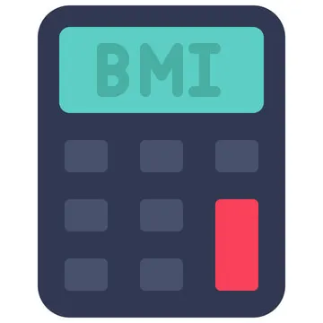

<a id="readme-top"></a>


<div align="center">
  <a href="https://github.com/Loggster1/BMI">
    
  </a>

  <h3 align="center">BMI Calculator</h3>

  <p align="center">
      A java program designed to calculate the users body mass index
    <br />
    <br />
    <br />
  </p>
</div>


<details>
  <summary>Table of Contents</summary>
  <ol>
    <li><a href="#about-the-project">About The Project</a></li>
    <li><a href="#getting-started">Getting Started</a></li>
    <li><a href="#features">Features</a></li>
    <li><a href="#technologies">Technologies</a></li>
    <li><a href="#license">License</a></li>
    <li><a href="#support">Support</a></li>
  </ol>
</details>

# About The Project
This is a java program developed to help one find their body mass index. The user inputs their height in feet and inches as well as their weight in pounds. The program the does some calculations and returns the users bmi.

# Features
| Features | Description |
| ------- | ----------- |
| **BMI Calculation** | Takes the users height and weight as input and outputs their bmi. |
| **BMI Chart** | Informational chart on right hand side of GUI showing the different bmi categories. |
| **GUI** | User inputs information into a GUI rather than a command line. |


# Getting Started
#### Prerequesites
* Java must be installed on your system (JDK 20+)

#### Download the Project
To get started, you can download the project as a `.zip` file by clicking the code button at the top of the page:

1. Go to the projects <a href="https://github.com/Loggster1/BMI">home page </a>
2. Select the green **Code** button at the top right of the page
3. Select `Download ZIP` at the bottom of the dropdown menu

#### Extract the Files
Once the `.zip` file is downloaded, you will need to extract it:

1. Locate the `.zip` file wherever you downloaded it
2. Right-click and select **Extract All...**
3. Choose where to extract the files to

#### Compile the Java Files

Once you have downloaded and extracted the project, you will need to compile the Java files in order for it to run:

1. Open your command prompt
2. Go to the folder where the project was extracted (use `cd path/to/folder` where path/to/folder is the location of the folder)
3. Run the following command to compile the necessary files:
   
   ```bash
   javac *.java

#### Run the Compiled Program
To run the program and finally start using the BMI calculator, use the following command:

  ```bash
  java BMI
```


# Technologies
* Java
* JDK 20+
* Github
* Netbeans
  

# License
This project is licensed under the [GNU General Public License v3.0](https://www.gnu.org/licenses/gpl-3.0.en.html).


# Support
[![LinkedIn][linkedin-shield]][linkedin-url]

logan@loggster.dev


[linkedin-shield]: https://img.shields.io/badge/-LinkedIn-black.svg?style=for-the-badge&logo=linkedin&colorB=555
[linkedin-url]: https://linkedin.com/in/logan-wallarab


<p align="right">(<a href="#readme-top">back to top</a>)</p>
